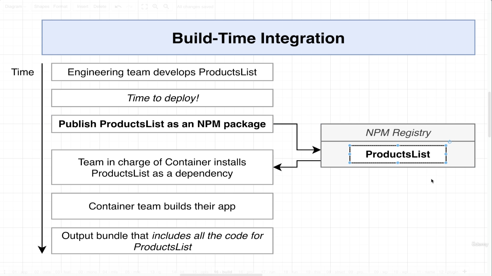
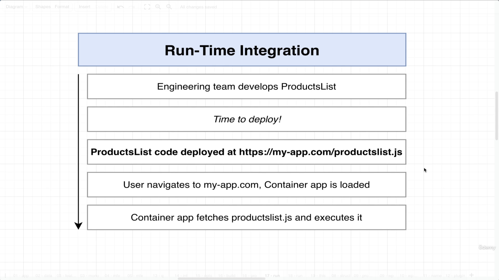

# Introduction 

Microfrontends are an architectural style where a web application is composed of smaller, semi-independent "microapps" working together. This concept is similar to microservices, but for frontend development. 
Here are some of the key benefits of using microfrontends: 

- **Independent Development and Deployment**: Teams can work on separate parts of the application independently, allowing for faster development cycles and more frequent updates.

- **Scalability**: As different parts of the application can be developed and scaled independently, it becomes easier to manage large-scale projects, especially when different teams are working on different features or sections.

- **Technology Agnosticism**: Microfrontends allow teams to use different frameworks or technologies for different parts of the application. This flexibility can be a significant advantage in using the best tool for each specific job.

- **Easier Code Management**: Smaller codebases are generally easier to understand, manage, and maintain than larger monolithic ones. This can lead to better code quality and less technical debt over time.

- **Isolation of Failures**: In a Microfrontend architecture, a problem in one microapp doesn’t necessarily crash the entire application. This isolation can improve the overall stability and reliability of the application.

- **Reusable Components**: Teams can build reusable components that can be shared across different parts of the application or even across different projects.

- **Experimentation and Iteration**: It's easier to experiment with new features, user interfaces, and user experiences on a smaller scale without impacting the entire application.

- **Focused Teams and Expertise**: Teams can be organized around specific business capabilities and develop expertise in those areas, leading to more effective and efficient development.

- **Incremental Upgrades**: Upgrading technology or redesigning parts of the application can be done incrementally, one microfrontend at a time, reducing the risk and complexity associated with big bang upgrades.

- **Enhanced Performance**: By loading only the necessary code and resources for each page or feature, microfrontends can potentially enhance the performance of web applications.

## Integration 

There are 3 main different approaches to building microfrontends

### Build-time 

- **Definition**: In build-time integration, the different microfrontends are combined during the build process. This means that the integration happens before the application is deployed.
- **Use Case**: It's suitable for scenarios where the composition of microfrontends is static and doesn't need to change dynamically at runtime.
- **Advantages**: Since the integration happens at build time, it can lead to optimized bundles and potentially better performance.
- **Disadvantages**: Lack of flexibility to change or update individual microfrontends independently after the build process. This approach can negate some of the key benefits of a microfrontend architecture, like independent deployments. It might be tempting to also closely connect the application and forget about separation of concerns. 

### Run-time 

- **Definition**: Run-time integration happens when the application is already running in the user's browser. The main application dynamically loads and integrates microfrontends.
- **Use Case**: This is ideal for dynamic and flexible applications where parts of the app need to be loaded, updated, or replaced independently while the app is running.
- **Advantages**: High flexibility and independence, allowing for continuous deployment and updates of individual microfrontends without redeploying the entire application. One part of the application can exist in different versions and the container can decide which one to use.
- **Disadvantages**: Can lead to challenges in managing dependencies and ensuring consistent performance, as well as potential issues with version conflicts and increased complexity in communication between microfrontends.

### Server Side 
- **Definition**: In server-side integration, microfrontends are assembled on the server and delivered as a unified application to the browser.
- **Use Case**: Useful when you want to render initial pages on the server for performance reasons (like faster initial load times) or for SEO optimization.
- **Advantages**: Can improve the initial load time and SEO, as the full content is served from the server. Also, it can simplify some aspects of integration compared to client-side run-time integration.
- **Disadvantages**: Less flexibility in dynamically updating parts of the application and potentially more server load, depending on the implementation.
